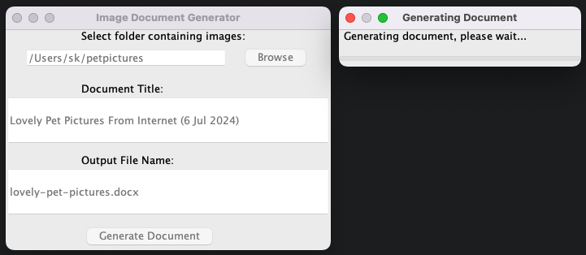
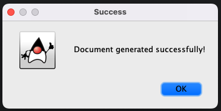
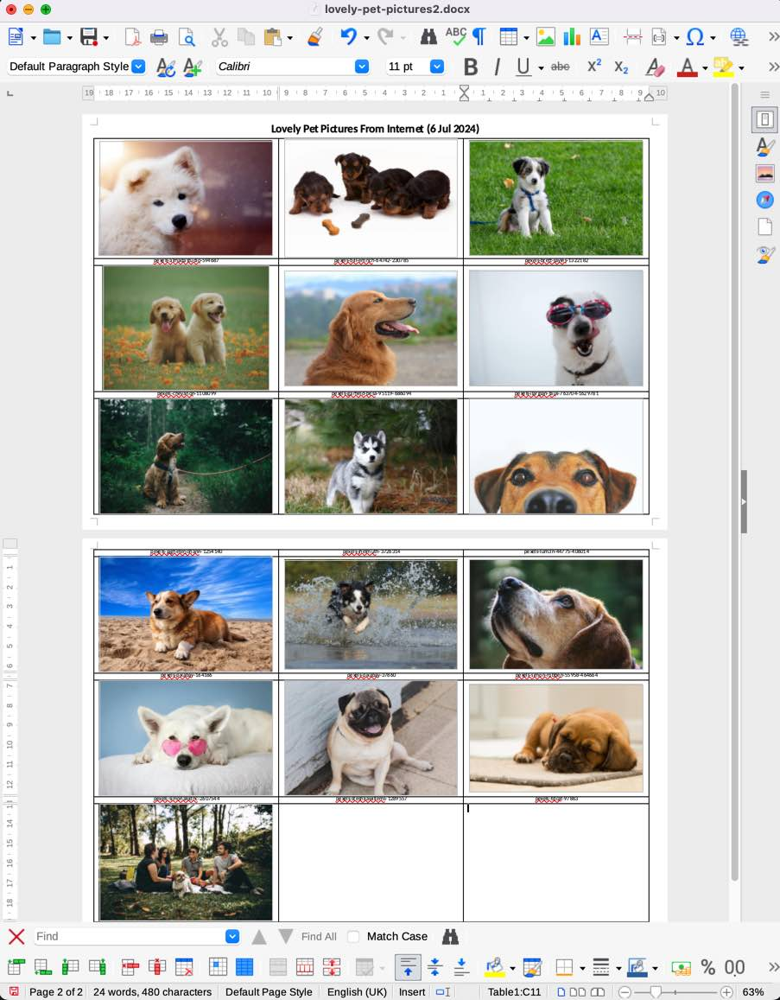

# Father Picture Report Producer

## Overview

The Image Document Generator is a Scala-based application designed to simplify the process of creating document-based photo albums. This project was inspired by my father's need for an easy way to compile and organise family photos into presentable documents.




Lovely Pet Pictures From Internet (6 Jul 2024)
lovely-pet-pictures

## Key Features

- Uses file names as captions for each image, eliminating the need for manual captioning
- Allows setting a custom title for the document via the GUI
- Arranges images in a grid layout per page
- Generates a document compatible with LibreOffice Writer for optimal formatting
- Simple graphical user interface for ease of use
- Supports multiple image formats (jpg, jpeg, png, gif, bmp)
- Optimises image sizes for consistent layout
- Supports both English and Korean interfaces



## Requirements

- Java Runtime Environment (JRE) 8 or higher
- LibreOffice Writer (recommended for best formatting results)

## Setup and Installation

### For Windows Users:
1. Download and install Microsoft OpenJDK from the official Microsoft website.
2. Download the `ImageDocGenerator.jar` file from the `release` folder in this project.
3. Double-click the JAR file to run the application.

### For Developers:
1. Ensure you have SBT (Scala Build Tool) installed.
2. Clone this repository:
   ```
   git clone https://github.com/your-username/image-doc-generator.git
   ```
3. Navigate to the project directory and build the project:
   ```
   cd image-doc-generator
   sbt assembly
   ```

## Usage

1. Run the application by double-clicking the JAR file.
2. Click "Browse" to select the folder containing your images.
3. Enter a title for your document in the provided field.
4. Specify the output file name (e.g., "family_album.docx").
5. Click "Generate Document" to create your photo album.
6. Open the generated document with LibreOffice Writer for the best formatting results.

## Unique Aspects

- **File Names as Comments**: Unlike typical photo album software, this program uses the file names of your images as captions in the document. This feature saves time and allows for easy organisation of photos with descriptive file names.
- **Custom Document Title**: The GUI allows you to set a custom title for your document, which appears at the top of the generated file.
- **Optimised for LibreOffice Writer**: While the generated document is in .docx format, it's specifically optimised for viewing and editing in LibreOffice Writer to ensure the best formatting.

## Technical Details

- Built with Scala 3
- Uses Apache POI for document generation
- Employs Scala Swing for the graphical interface

## Acknowledgments

- Special thanks to my father for inspiring this project